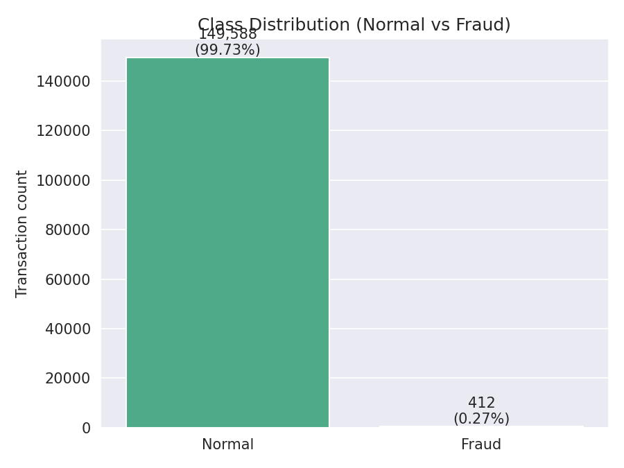
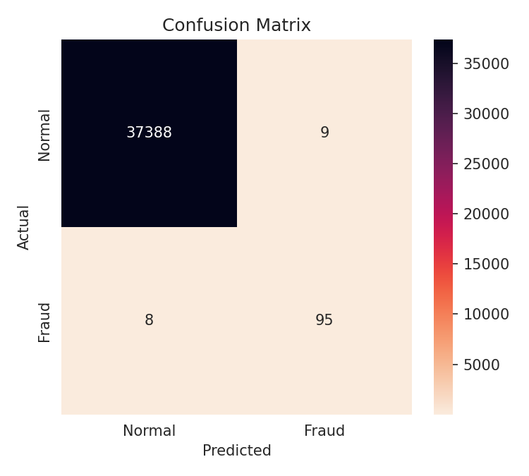

# FraudGuard.live — Real-Time Financial Fraud Detection System

## Overview

This project is an end-to-end Machine Learning microservice that detects fraudulent
credit card transactions **as they happen**. It bridges Data Science and Cloud
Engineering: a Random Forest model (trained on imbalanced data using SMOTE) is
deployed behind a FastAPI service that streams live transactions over a
WebSocket, scores each one the instant it arrives, and renders the verdicts and
analytics on a real-time dashboard.




## What's "live" about it

- A **WebSocket feed** (`/ws/stream`) replays a held-out, labeled pool of
  transactions (oversampled for fraud so the demo is actually interesting to
  watch) and scores each one with the real trained model in real time —
  nothing is precomputed or canned.
- The **dashboard** updates instantly on every message: a scrolling live
  ledger, running totals, fraud rate, average transaction size, live model
  accuracy, a fraud-vs-normal donut chart, and a rolling fraud-rate trend
  line.
- Flagged transactions get pushed into a **Recent Alerts** panel with the
  model's confidence score.
- The classic synchronous `POST /predict` endpoint is still there for direct
  API testing (curl, Swagger UI, integration tests).

## Architecture

The project is split into two phases, same as before:

1. **The ML Pipeline** (`fraud_detection_pipeline.py`) — loads `creditcard.csv`
   if you've downloaded it from Kaggle, otherwise auto-generates a realistic
   synthetic dataset with the same schema (`Time`, `V1`–`V28`, `Amount`,
   `Class`) and the same ~99.7% / 0.3% class imbalance, so the whole project
   runs out of the box with zero setup. It performs EDA, balances the
   training set with SMOTE, trains the Random Forest, evaluates it, and
   serializes the model (`fraud_model.pkl`) plus a labeled stream-replay pool
   (`stream_data.pkl`) used to power the live feed.
2. **The Live API** (`app.py`, `templates/`, `static/`, `Dockerfile`) — a
   FastAPI server that loads the serialized model, exposes `/predict` and
   `/ws/stream`, serves the dashboard, and is containerized with Docker for
   deployment anywhere (AWS, Azure, Render, Kubernetes...).

## Project structure

```
Financial-Fraud-Detection/
├── .gitignore
├── Dockerfile
├── README.md
├── DEPLOYMENT.md
├── requirements.txt
├── app.py                      # FastAPI app: /predict, /ws/stream, dashboard
├── fraud_detection_pipeline.py # EDA -> SMOTE -> train -> evaluate -> serialize
├── fraud_model.pkl             # trained Random Forest (committed, ready to serve)
├── stream_data.pkl             # labeled pool replayed over the live feed
├── class_distribution.png
├── confusion_matrix.png
├── templates/
│   └── index.html              # dashboard markup
└── static/
    ├── css/style.css           # dashboard styling
    └── js/dashboard.js         # WebSocket client, charts, live ledger
```

## Tech Stack

- **Cloud & DevOps:** Docker, RESTful APIs, WebSockets
- **Backend:** Python, FastAPI, Uvicorn
- **Machine Learning:** Scikit-Learn, Imbalanced-Learn (SMOTE), Pandas, NumPy
- **Visualization:** Matplotlib, Seaborn (offline EDA) · Chart.js (live dashboard)
- **Frontend:** HTML, CSS, vanilla JavaScript (no framework — keeps the stack
  identical to what's listed above, FastAPI just serves it directly)

## How to Run Locally (no Docker)

```bash
git clone https://github.com/<your-username>/Financial-Fraud-Detection.git
cd Financial-Fraud-Detection

pip install -r requirements.txt

# Optional: drop a real creditcard.csv (from Kaggle) in the root to train on
# actual data. If you skip this, the pipeline auto-generates a realistic
# synthetic dataset with the same schema and class imbalance.
python fraud_detection_pipeline.py

uvicorn app:app --reload
```

Open **http://localhost:8000** to watch the live dashboard, or
**http://localhost:8000/docs** for the interactive Swagger UI to test
`POST /predict` directly.

## How to Run with Docker

```bash
docker build -t fraud-detection-api .
docker run -d -p 8000:8000 fraud-detection-api
```

Then open **http://localhost:8000**.

`fraud_model.pkl` and `stream_data.pkl` are already committed to the repo, so
the container is servable immediately — no Kaggle download required. If you
want to retrain on real data, drop `creditcard.csv` in the root, re-run
`python fraud_detection_pipeline.py` locally to refresh the `.pkl` files, then
rebuild the image.

## Testing the API directly

```bash
curl -X POST http://localhost:8000/predict \
  -H "Content-Type: application/json" \
  -d '{"Time": 5000, "V1": -1.2, "V2": 0.5, ... "Amount": 120.50}'
```

The API responds in sub-millisecond time with `"Approved"` or `"ALERT"` plus a
fraud probability.

## Deploying to the cloud

See **[DEPLOYMENT.md](DEPLOYMENT.md)** for step-by-step instructions to
deploy this on **Render** (recommended — full backend + WebSocket support),
and how to split the frontend onto **Netlify** with the backend on Render if
you want the static dashboard hosted separately.

## A note on the data

The real Kaggle "Credit Card Fraud Detection" dataset (anonymized European
cardholder transactions, PCA-transformed `V1`–`V28` features) isn't bundled
here due to size and license. The pipeline auto-generates a synthetic
stand-in with the same schema and the same extreme class imbalance, so
everything — training, evaluation, and the live demo — works immediately.
Drop the real `creditcard.csv` in the root to train on actual data instead.
